You are working as a statistical consultant for a tennis racquet
manufacturer, helping with some statistical analysis they hope can be of
use in an upcoming advertising campaign. The company has selected 31 new
models of racquets produced by that company and others and measured six
variables, which represent various characteristics of the racquets: • X1
– length of racquet (in inches) • X2 – static weight (in ounces) – this
is how much the racquet actually weighs on a scale • X3 – balance (in
inches) – this is a measure of whether the racquet is heavier in on the
head end or on the handle end; more negative values indicate a more
head-heavy racquet; positive values indicate a more head-light racquet;
zero indicates an even balance. • X4 – swing weight – this is a
complicated measure of how heavy the racquet feels when it is swung. •
X5 – headsize (in square inches) – the size of the racquet face (the
strung area) • X6 – beamwidth (in mm) – the width of the cross-section
(edge) of the racquet

QUESTION 1. Are there particular racquet(s) that are highly unusual in
terms of the measured characteristics? If so, identify them.

``` r
library(MASS)
```

    ## Warning: package 'MASS' was built under R version 3.6.2

``` r
library(lattice)
```

DATA

``` r
Tennis.Racquets = read.csv("C:/Users/fb8502oa/Desktop/Github stuff/Cluster-Analysis/Tennis Racquets.csv")
head(Tennis.Racquets)
```

    ##                Racquet length static.weight balance swingweight headsize
    ## 1             Asics109  27.25          10.4   0.375         321      109
    ## 2             Asics116  27.25           9.6   0.000         287      116
    ## 3             Asics125  27.50           9.6   0.000         303      125
    ## 4     BabolatPureDrive  27.00          11.1   0.500         308      100
    ## 5 BabolatPureDriveLite  27.00          10.3   0.375         298      100
    ## 6  BabolatPureDrive107  27.20          10.4   0.250         298      107
    ##   beamwidth Cluster
    ## 1        25       1
    ## 2        25       1
    ## 3        28       1
    ## 4        26       2
    ## 5        25       3
    ## 6        25       1

``` r
summary(Tennis.Racquets)
```

    ##                  Racquet       length      static.weight  
    ##  Asics109            : 1   Min.   :27.00   Min.   : 9.60  
    ##  Asics116            : 1   1st Qu.:27.00   1st Qu.:10.45  
    ##  Asics125            : 1   Median :27.00   Median :11.00  
    ##  BabolatPureDrive    : 1   Mean   :27.09   Mean   :10.93  
    ##  BabolatPureDrive107 : 1   3rd Qu.:27.23   3rd Qu.:11.40  
    ##  BabolatPureDriveLite: 1   Max.   :27.60   Max.   :12.20  
    ##  (Other)             :25                                  
    ##     balance         swingweight       headsize       beamwidth    
    ##  Min.   :-0.3750   Min.   :280.0   Min.   : 93.0   Min.   :19.00  
    ##  1st Qu.: 0.3540   1st Qu.:303.0   1st Qu.: 98.0   1st Qu.:21.50  
    ##  Median : 0.5000   Median :312.0   Median :100.0   Median :23.50  
    ##  Mean   : 0.4664   Mean   :310.6   Mean   :102.1   Mean   :23.89  
    ##  3rd Qu.: 0.6250   3rd Qu.:320.0   3rd Qu.:107.0   3rd Qu.:26.00  
    ##  Max.   : 1.0000   Max.   :330.0   Max.   :125.0   Max.   :29.00  
    ##                                                                   
    ##     Cluster     
    ##  Min.   :1.000  
    ##  1st Qu.:2.000  
    ##  Median :3.000  
    ##  Mean   :2.774  
    ##  3rd Qu.:4.000  
    ##  Max.   :4.000  
    ## 

looking for outlyers.

``` r
outlyer = boxplot(Tennis.Racquets)$out 
```

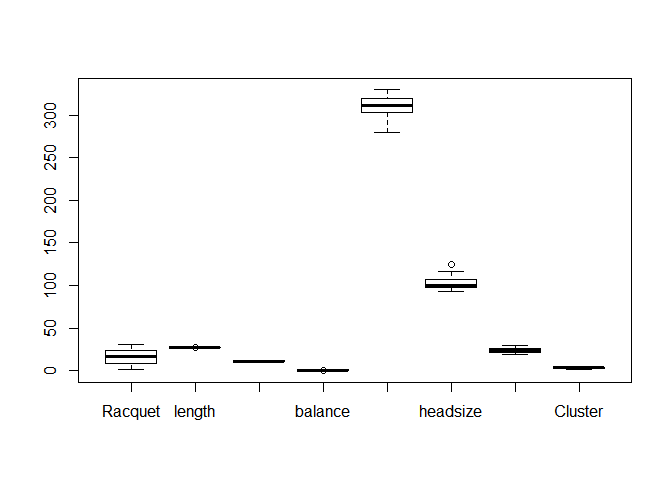

``` r
outlyer
```

    ## [1]  27.600  -0.375 125.000

the outlayers are: 27.600 (length) = volklorganixv1oversize -0.375
(balance) = dunlopBiomimetic700 125.00 (headsize) = Asics125

QUESTION 2. Are there notable associations/relationships between some of
the variables? (if so, describe them and present them graphically)

``` r
#finding correlation
library(corrplot)
```

    ## corrplot 0.84 loaded

``` r
Tennissub = Tennis.Racquets[, -c(1)]  # this is th subset that works well. 
Tennissub.cor = cor(Tennissub)
plot(corrplot(Tennissub.cor, order = "hclust"))
```

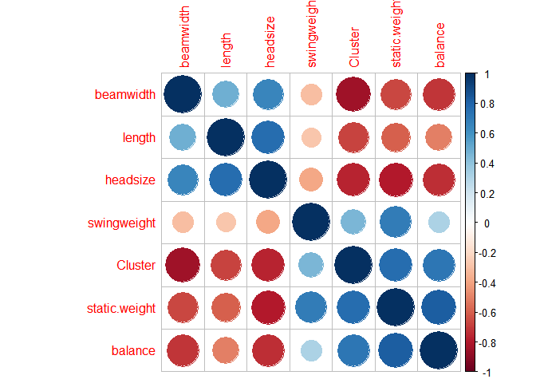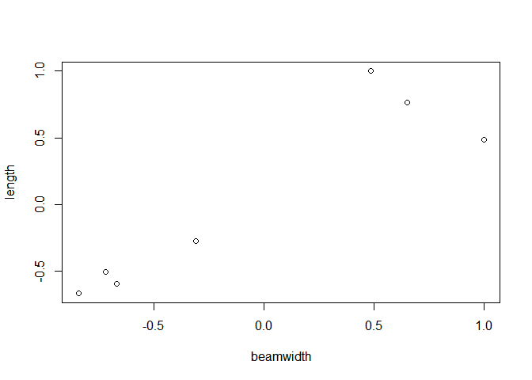

``` r
cor(Tennissub)
```

    ##                   length static.weight    balance swingweight   headsize
    ## length         1.0000000    -0.5987585 -0.5097209  -0.2773809  0.7620360
    ## static.weight -0.5987585     1.0000000  0.8274556   0.6958924 -0.7994298
    ## balance       -0.5097209     0.8274556  1.0000000   0.3167457 -0.7380887
    ## swingweight   -0.2773809     0.6958924  0.3167457   1.0000000 -0.3806122
    ## headsize       0.7620360    -0.7994298 -0.7380887  -0.3806122  1.0000000
    ## beamwidth      0.4861756    -0.6661721 -0.7179380  -0.3063892  0.6523363
    ## Cluster       -0.6700189     0.7684393  0.7210804   0.4528169 -0.7650102
    ##                beamwidth    Cluster
    ## length         0.4861756 -0.6700189
    ## static.weight -0.6661721  0.7684393
    ## balance       -0.7179380  0.7210804
    ## swingweight   -0.3063892  0.4528169
    ## headsize       0.6523363 -0.7650102
    ## beamwidth      1.0000000 -0.8411972
    ## Cluster       -0.8411972  1.0000000

Static weight and balance are moderately correlated while beam width,
length, head size, swing weight are strongly correlated.

QUESTION 3

Is there a way to graphically represent the raw data for the 31 racquets
and draw conclusions about the data set from such a graph?

``` r
pca = princomp(Tennissub, cor = TRUE)
summary(pca)
```

    ## Importance of components:
    ##                           Comp.1    Comp.2     Comp.3     Comp.4    Comp.5
    ## Standard deviation     2.1885779 0.9391220 0.78322234 0.62687767 0.4023273
    ## Proportion of Variance 0.6842676 0.1259929 0.08763389 0.05613937 0.0231239
    ## Cumulative Proportion  0.6842676 0.8102605 0.89789437 0.95403374 0.9771576
    ##                            Comp.6      Comp.7
    ## Standard deviation     0.33479226 0.218656454
    ## Proportion of Variance 0.01601227 0.006830092
    ## Cumulative Proportion  0.99316991 1.000000000

``` r
biplot(pca)
```

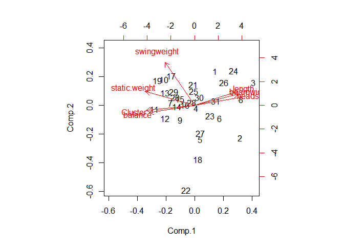

Length, beam width and head size are more correlated than swing weight,
static weight and balance 22 is an outlier.

QUESTION 4 & QUESTION 5 Can we find a few indices that describe the
variation in the data set using a lesser dimension than the original set
of variables?

? If so, what are those indices? Is there a convenient interpretation of
any of the indices?

``` r
library(cluster)
library(factoextra)
```

    ## Loading required package: ggplot2

    ## Warning: package 'ggplot2' was built under R version 3.6.2

    ## Welcome! Related Books: `Practical Guide To Cluster Analysis in R` at https://goo.gl/13EFCZ

``` r
library(FactoMineR)
Tennissub.mat = scale(Tennissub)
```

``` r
tennis.PCA = PCA(Tennissub.mat, quali.sup = 1)
```

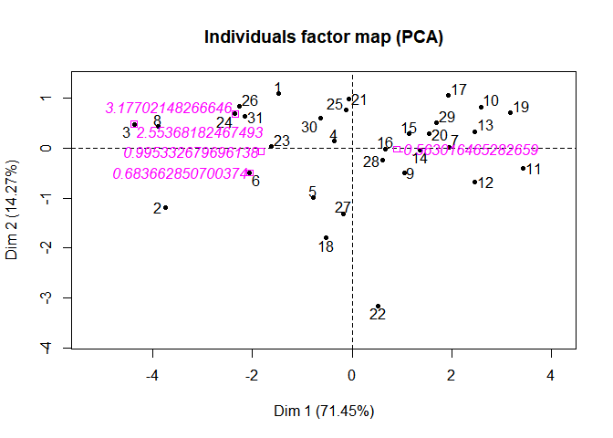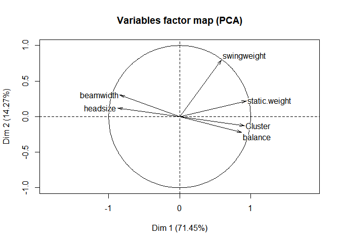

``` r
summary(tennis.PCA)
```

    ## 
    ## Call:
    ## PCA(X = Tennissub.mat, quali.sup = 1) 
    ## 
    ## 
    ## Eigenvalues
    ##                        Dim.1   Dim.2   Dim.3   Dim.4   Dim.5   Dim.6
    ## Variance               4.287   0.856   0.407   0.281   0.122   0.048
    ## % of var.             71.446  14.265   6.776   4.684   2.025   0.804
    ## Cumulative % of var.  71.446  85.711  92.487  97.170  99.196 100.000
    ## 
    ## Individuals (the 10 first)
    ##                        Dist    Dim.1    ctr   cos2    Dim.2    ctr   cos2
    ## 1                  |  2.194 | -1.471  1.628  0.449 |  1.096  4.528  0.250
    ## 2                  |  4.069 | -3.754 10.605  0.851 | -1.187  5.307  0.085
    ## 3                  |  4.751 | -4.377 14.417  0.849 |  0.486  0.892  0.010
    ## 4                  |  1.088 | -0.353  0.094  0.105 |  0.140  0.074  0.017
    ## 5                  |  1.526 | -0.782  0.460  0.262 | -0.991  3.705  0.422
    ## 6                  |  2.242 | -2.055  3.178  0.840 | -0.491  0.909  0.048
    ## 7                  |  1.995 |  1.949  2.859  0.954 |  0.026  0.002  0.000
    ## 8                  |  4.078 | -3.886 11.361  0.908 |  0.437  0.721  0.012
    ## 9                  |  1.371 |  1.054  0.835  0.591 | -0.489  0.902  0.127
    ## 10                 |  2.766 |  2.581  5.011  0.870 |  0.826  2.570  0.089
    ##                       Dim.3    ctr   cos2  
    ## 1                  | -0.112  0.099  0.003 |
    ## 2                  | -0.838  5.566  0.042 |
    ## 3                  | -1.041  8.596  0.048 |
    ## 4                  |  1.001  7.944  0.846 |
    ## 5                  |  0.131  0.135  0.007 |
    ## 6                  |  0.220  0.383  0.010 |
    ## 7                  | -0.375  1.116  0.035 |
    ## 8                  | -0.509  2.057  0.016 |
    ## 9                  | -0.463  1.699  0.114 |
    ## 10                 |  0.103  0.084  0.001 |
    ## 
    ## Variables
    ##                       Dim.1    ctr   cos2    Dim.2    ctr   cos2    Dim.3
    ## static.weight      |  0.940 20.594  0.883 |  0.222  5.778  0.049 |  0.172
    ## balance            |  0.873 17.760  0.761 | -0.222  5.750  0.049 |  0.266
    ## swingweight        |  0.588  8.061  0.346 |  0.795 73.757  0.631 | -0.123
    ## headsize           | -0.872 17.719  0.760 |  0.122  1.752  0.015 | -0.275
    ## beamwidth          | -0.842 16.531  0.709 |  0.307 11.032  0.094 |  0.386
    ## Cluster            |  0.910 19.335  0.829 | -0.129  1.931  0.017 | -0.259
    ##                       ctr   cos2  
    ## static.weight       7.267  0.030 |
    ## balance            17.375  0.071 |
    ## swingweight         3.702  0.015 |
    ## headsize           18.545  0.075 |
    ## beamwidth          36.602  0.149 |
    ## Cluster            16.509  0.067 |
    ## 
    ## Supplementary categories
    ##                        Dist    Dim.1   cos2 v.test    Dim.2   cos2 v.test
    ## -0.563016465282659 |  0.909 |  0.896  0.973  3.708 | -0.015  0.000 -0.134
    ## 0.683662850700374  |  2.242 | -2.055  0.840 -0.993 | -0.491  0.048 -0.531
    ## 0.995332679696138  |  1.887 | -1.824  0.935 -2.364 | -0.061  0.001 -0.177
    ## 2.55368182467493   |  4.751 | -4.377  0.849 -2.114 |  0.486  0.010  0.526
    ## 3.17702148266646   |  2.706 | -2.347  0.752 -1.133 |  0.690  0.065  0.745
    ##                       Dim.3   cos2 v.test  
    ## -0.563016465282659 |  0.083  0.008  1.108 |
    ## 0.683662850700374  |  0.220  0.010  0.345 |
    ## 0.995332679696138  | -0.319  0.029 -1.343 |
    ## 2.55368182467493   | -1.041  0.048 -1.632 |
    ## 3.17702148266646   |  0.921  0.116  1.445 |

the main area to focus on is

``` r
summary(pca)
```

    ## Importance of components:
    ##                           Comp.1    Comp.2     Comp.3     Comp.4    Comp.5
    ## Standard deviation     2.1885779 0.9391220 0.78322234 0.62687767 0.4023273
    ## Proportion of Variance 0.6842676 0.1259929 0.08763389 0.05613937 0.0231239
    ## Cumulative Proportion  0.6842676 0.8102605 0.89789437 0.95403374 0.9771576
    ##                            Comp.6      Comp.7
    ## Standard deviation     0.33479226 0.218656454
    ## Proportion of Variance 0.01601227 0.006830092
    ## Cumulative Proportion  0.99316991 1.000000000

Yes we can find indices that describe the variation in the dataset. The
pca values the show total variation are 7. The 7 components explain
total variation of the 31 racquets.

QUESTION 6 Can we graphically display the data in a low number of
dimensions using such indices? What conclusions about the racquets
(individual racquets or groups of racquets) can you draw from such a
graph

``` r
Tennissub.k15 =kmeans(Tennissub,15)
tennis.kmeans = kmeans(Tennissub.mat, 7)
fviz_cluster(tennis.kmeans,data=Tennissub)
```

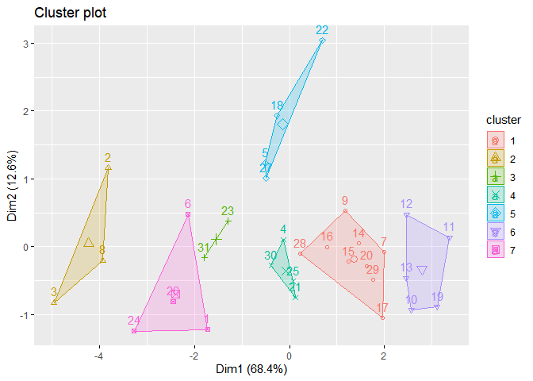

``` r
plot(fviz_pca_ind(tennis.PCA, col.ind = tennis.kmeans$cluster))
```

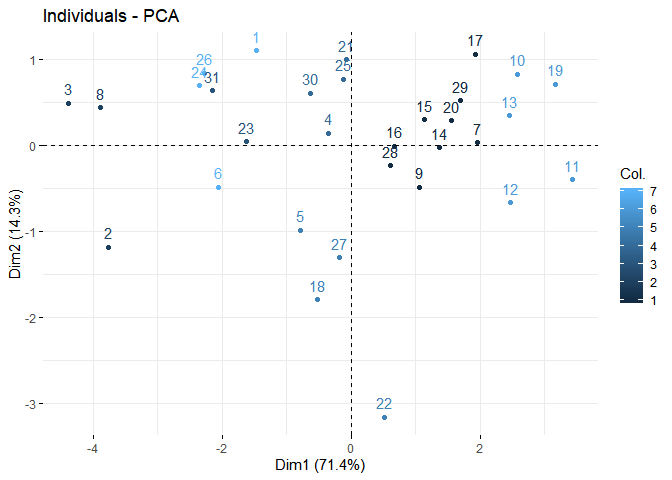

``` r
View(Tennis.Racquets)
```

Question 7. Can you find groups/clusters of similar racquets in terms of
their characteristics? If so, can you find a group of racquets that
would be good novice players using the specifications listed in part f ?

``` r
Tennissub.euc = dist(Tennissub.mat, method = "euclid")
cluster = agnes(Tennissub.euc, method = "ward")
```

``` r
plot(cluster)
```

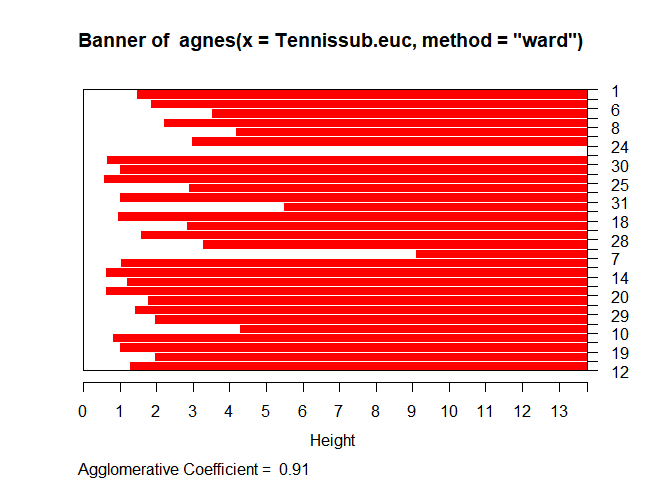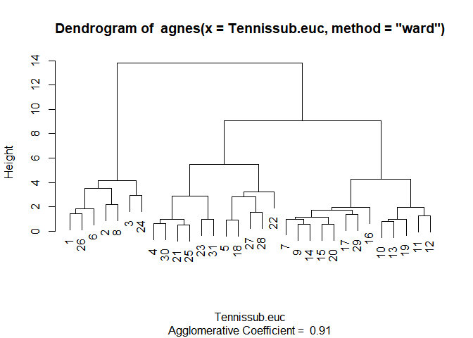

``` r
par(ask =F)
```

``` r
# h 
#k-maeans
wss = rep(0,8)
for(i in 1: 8)
  wss[i] = sum(kmeans(Tennissub.mat, centers = i)$withinss)
plot(1:8, wss, xlab = "number of cluster", ylab = "wss", type = "b")
```

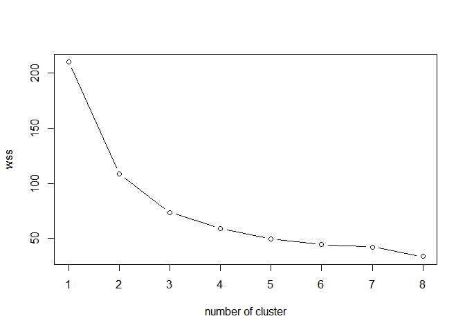

as you can see, 5 is better than 8.

``` r
Tennissub.k5 = kmeans(Tennissub.mat,5)
si = silhouette(Tennissub.k5$cluster, Tennissub.euc)
plot(si)
```

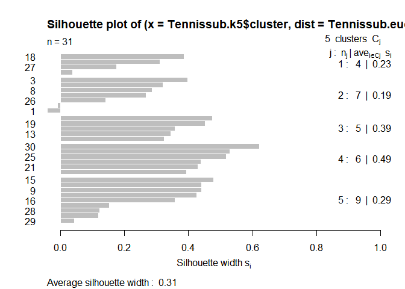
